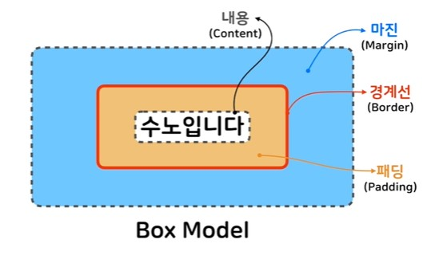

# CSS

## ◈ HTML에 CSS를 적용하는 방법

<br>

> * Link style : HTML에 외부에 있는 CSS파일을 불러옴
> * Embedding style : HTML의 head태그에 style태그를 이용하여 CSS를 작성
> * Inline style : HTML요소에 직접 style속성을 이용하여 CSS를 작성

<br>

## ◈ 선택자

> : 스타일을 적용하고자 하는 HTML요소를 선택하는 역할
>
><br>
>
> ### ▣ 타입 선택자 : 해당 태그를 가지는 모든 요소에 스타일 적용
>>
>>````html
>><style>
>>    p { color: red; }
>>(선택자 / 속성 / 속성 값)
>></style>
>>````
>
><br>
>
> ### ▣ 아이디 선택자 : id로 해당 id 하나에 스타일 적용(id는 단 하나)
>
>>````html
>><style>
>>    #snow { color: red; }
>></style>
>><body>
>>    <h1 id="snow">~~~</h1>
>></body>
>>````
>
><br>
>
> ### ▣ 클래스 : 비슷한 특징을 갖는 요소를 지정하여 묶을 수 있음
>
>>````html
>><style>
>>    .contents { color: red; }
>></style>
>><body>
>>    <h1 class="contents">~~~</h1>
>>    <p class="contents">---</p>
>></body>
>>````
>
><br>
>
> ### ▣ 전체 선택자 : 모든 요소에 스타일을 적용 (속도 저하 가능성 있음)
>
>>````html
>><style>
>>    * { color: red; }
>></style>
>><body>
>>    <h1 class="contents">~~~</h1>
>>    <p class="contents">---</p>
>></body>
>>````
>
><br>
>
> ### ▣ 속성 선택자 : 특정 속성을 소유하는 모든 요소에 스타일 적용
>
>>````html
>><style>
>>    a[target="_1"] { color: red; }   →ㄱㄴㄷ만 적용
>></style>
>><body>
>>    <a herf="~~" target="_1">ㄱㄴㄷ</a>
>>    <a herf="--" target="_2">ㅁㄴㅇ</a>
>></body>
>>````
>
><br>
>
> ### ▣ 복합선택자
>
>> * 자식 선택자 : 선택자A의 모든 자식 중 선택자B와 일치하는 요소 선택
>>
>>````html
>>  선택자A > 선택자B {color: red;}
>>````
>>
>> * 후손 선택자 : 선택자A의 모든 후손 중 선택자B와 일치하는 요소 선택
>>
>>````html
>>  선택자A 선택자B {color: red;}
>>````
>
><br>
>
> ### ▣ pseudo 클래스 : 요소의 특별한 상태를 지정할 때 씀
>
>>
>> * link : 방문하지 않은 링크일 경우
>> * visited : 방문한 링크일 경우
>> * hover : 요소에 마우스가 올라와 있는 상태
>>
>>````html
>><style>
>>    a:link { color: red; }
>>    a:visited { background-color: blue; }
>></style>
>><body>
>>    <a herf="~~" target="_1">ㄱㄴㄷ</a>
>></body>
>>````

<br>

## ◈ 값

<br>

> ### ▣ 숫자값
>
> <br>
>
>> * px : 1/96 in(인치) → 절대 길이
>> * em : 현재 스타일이 지정된 요소의 font-size기준 → 상대 길이
>> * rem : 최상위 요소의 font-size기준 → 상대 길이
>>
>>> 1em(rem)의 크기 = 기준 font-size*1em(1rem)
>
>````html
> font-size: 32px;
>````
>
> <br>
>
> ### ▣ %(퍼센트)
>
> : 상대 길이, 보통 이미지나 레이아웃의 너비나 높이를 지정할 때 씀
>
>````html
> width: 50%;
>````

<br>

## ▣ 색상
>
> * hex code : #000000 ~ #ffffff
>
>> 투명도 : #00ff0050 → 6자리 뒤에 00~ff 값 추가
>
> * rgb : rgb(0,0,0) ~ rgb(255,255,255)
>
>> 투명도: rgba(255,0,0,.5) → 4번째 값 추가
>
> * hsl

<br>

## ▣ 폰트와 관련된 프로퍼티

> <br>
>
> * font-size
>
> * font-family
>
>> 폰트의 종류는 여러개 지정 가능하며 앞에서부터 적용함(폰트가 존재하지 않으면 뒤에 지정한 폰트로 적용)
>
> * font-style
>
>> normal, italic, oblique
>
> * font-weight
>
>> bold,normal 혹은 100 ~ 900

<br>

## ▣ 텍스트 정렬과 관련된 속성
>
> : 적용하는 요소를 기준으로 정렬됨
>
> * text-align : 텍스트를 좌,우,중앙 정렬함
>
>````html
>  h1 { text-align: center; }
>  p { text-align: right; }
>````
>
> * line-height : 문장 사이의 간격을 조정함
>
>````html
>  p1 { line-height: 24px; }
>  p2 { text-align: 2; } → 단위 없는 숫자 : 해당 요소의 폰트 사이즈 배
>````
>
> * letter-spacing : 글자와 글자 사이의 간격을 조정함, 자간
>
>````html
>  p { letter-spacing: 5px; }
>````
>
> * text-indent : 문단의 시작부에 들여쓰기를 함
>
>````html
>  p { text-indent: 5px; }
>````

<br>

## ◈ 박스 모델
>
>
>
>````html
><style>
>
>    #inner {
>        width: 200px;
>        height: 100px;
>        margin: 10px;
>        padding: 20px;
>        overflow: hidden;
>    }
>
></style>
>````
>
> ▣ Content
>>
>> * overflow: hidden;  →  벗어난 내용 숨기기
>> * overflow: scroll;  →  벗어난 내용 스크롤 처리
>
> ▣ Border (상우하좌 순으로 4개까지 입력 가능)
>
>> * border-style : dashed, solid, dotted, double
>> * border-width
>> * border-color
>>
>> ※ 한번에 입력 가능함
>> ex)  border: 4px solid red;
>>
>> * border-radius : 값을 입력받아 둥근 테두리 형성

<br>

## ◈ display : 요소가 보여지는 방식 지정
>
> * block 요소 : div, h1~h6, p, header, section 등이 해당
> → width, height, margin, padding 가능
> * inline 요소 : a, span, img 등이 해당
> → width, height, margin-top, margin-bottom 불가능
> * display: inline-block;
> → width, height, margin-top, margin-bottom 가능

<br>

## ◈ position : 요소의 위치를 정의
>
> * position: static; : 기본값, 좌표 프로퍼티를 쓸 수 없음
> * position: relative; : 상대 위치, 기본 위치를 기준으로 좌표를 사용함
>
>````html
>  position: relative;
>  top: 20px;
>  left: 20px;
>````
>
> * position: absolute; : 부모나 조상 중 relative, absolute, fixed가 선언된 곳을 기준으로 좌표 프로퍼티 적용
> * position: fixed; : 보이는 화면을 기준으로 좌표 프로퍼티를 이용하여 위치를 고정
> * z-index : 숫자가 클수록 요소가 전면에 위치함
>
>````html
><style>
>
>    #top {
>        z-index: 2;
>    }
>    #bottom {
>        z-index: 1;
>    }
>
></style>
>````

<br>

## ◈ flexbox
>
> ▣ 부모 요소
>
>> * flex-direction : flex 컨테이너 안의 item들의 방향을 정함(기본은 row)
>>>
>>> row, row-reverse, column, column-reverse
>>
>> * flex-wrap : flex 아이템이 flex 컨테이너를 벗어 났을 때 줄을 바꾸는 속성(기본은 nowrap)
>>
>> * justify-content : flex-direction으로 정해진 방향을 기준으로 수평으로 item을 정렬하는 방법을 정함(기본은 flex-start)
>>>
>>> center, flex-end, space-around, space-between
>>
>> * align-items : flex-direction으로 정해진 방향을 기준으로 수직으로 item을 정렬하는 방법을 정함(기본은 stretch)
>>>
>>> flex-start, flex-end, center, baseline, space-between, space-around
>>
>> * align-content
>
> ▣ 자식 요소
>
>> * flex-grow : flex 아이템의 확장과 관련된 속성(기본은 0)
>> * flex-shrink : flex 아이템의 축소와 관련된 속성(기본은 1)
>> * flex-basis : flex 아이템의 기본 크기를 결정함(기본은 auto)
>> * flex : 위 3개의 축약형
>>>
>>> flex: 0 1 auto;

## ◈ 상속
>
> ※ margin: inherit; : 상속되지 않는 프로퍼티를 상속에서 값을 상속받으려고 할 때
>
> ▣ 규칙
>>
>> 1. 중요도 : head태그 내의 style 태그 > head태그 내의 style태그 내의 @import문 > link태그로 연결된 CSS > link태그로 연결된 CSS 내의 @import > 문브라우저 디폴트 스타일시트
>> 2. 명시도 : !important > 인라인 스타일 > 아이디 선택자 > 클래스, 속성, 가상클래스 선택자 > 태그 선택자 > 전체 선택자 > 상속
>> 3. 선언 순서 : 나중에 선언된 스타일이 우선 적용
